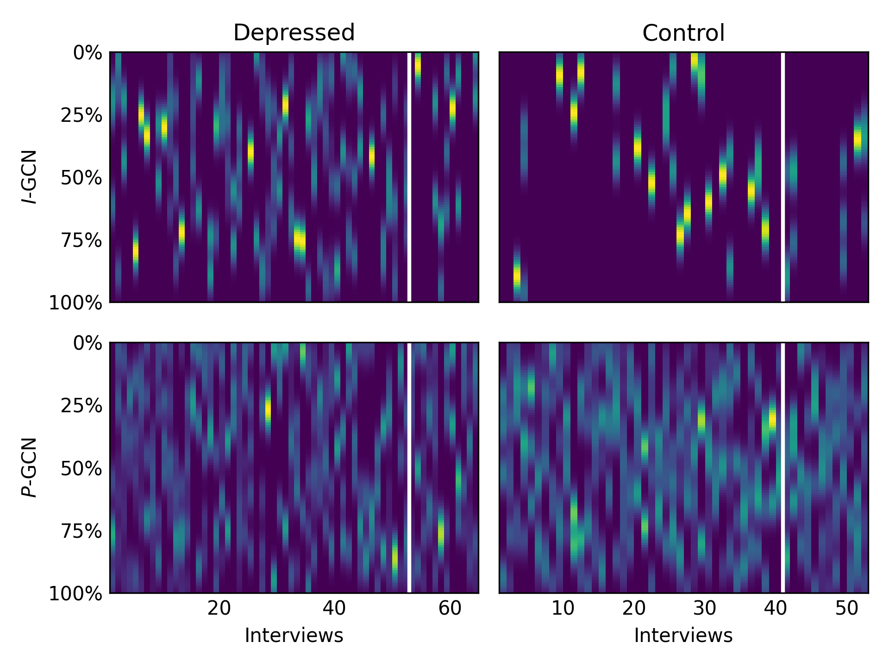
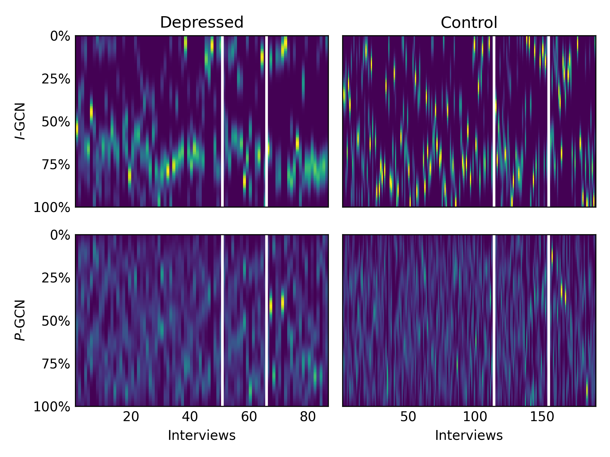
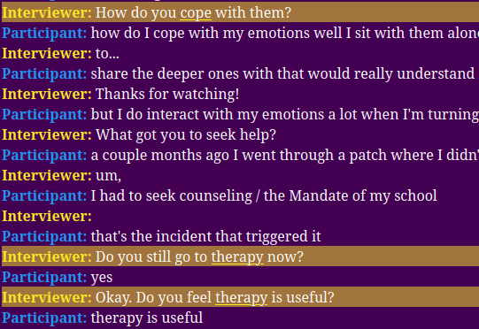

# When Consistency Becomes Bias: Interviewer Effects in Semi-Structured Clinical Interviews

> **LREC 2026** — Hasindri Watawana, Sergio Burdisso, Diego A. Moreno-Galván, Fernando Sánchez-Vega, A. Pastor López-Monroy, Petr Motlicek, Esaú Villatoro-Tello

[]()
[]([LICENSE](https://github.com/idiap/bias_in_daic-woz/tree/main/LICENSE))
<!-- ! [](https://www.idiap.ch) -->
<!-- ! [](https://www.cimat.mx) -->

The codebase that was use to run all the experiments are described in this [README](https://github.com/idiap/bias_in_daic-woz/tree/main/). 

---

## TL;DR

**Can a model detect depression using *only* the interviewer's questions — without ever seeing a single patient response?**

Surprisingly, **yes**. Across three clinical interview datasets and two model architectures, models trained exclusively on interviewer prompts often **match or outperform** those trained on participant responses. This doesn't mean interviewers are better diagnosticians — it means models are exploiting **scripted shortcuts** embedded in the interview structure.

---

## The Problem

Automatic depression detection from clinical interviews is a growing research area. Many recent systems jointly use both interviewer questions and participant answers. But **how much does each speaker actually contribute** to model performance?

<!--  -->
<!-- TODO: Add a high-level overview figure illustrating the I vs P model setup -->

We find that semi-structured interview protocols — designed for clinical consistency — inadvertently create **prompt-induced bias**: fixed question sequences and scripted follow-ups that leak diagnostic information before the patient even speaks.

---

## Key Findings

### 1. Interviewer-only models rival or beat participant-only models

| Dataset | Model | Participant-only (P) | Interviewer-only (I) |
|:--------|:------|:-------------------:|:--------------------:|
| ANDROIDS | Longformer | 0.79 | **0.98** |
| ANDROIDS | GCN | 0.93 | **0.97** |
| DAIC-WOZ | Longformer | 0.71 | **0.73** |
| DAIC-WOZ | GCN | 0.85 | **0.88** |
| E-DAIC | Longformer | **0.67** | 0.65 |
| E-DAIC | GCN | 0.70 | **0.74** |

*Development-set macro-F1 scores. On ANDROIDS, interviewer-only Longformer achieves **0.98 F1** — a 19-point gain over the participant-only model.*

### 2. The bias is model-agnostic

The effect reproduces across two fundamentally different architectures:
- **Longformer** — a transformer with sparse attention for long documents
- **ω-GCN** — a graph convolutional network with word and document nodes

This rules out architecture-specific artifacts as an explanation.

### 3. Interviewer models focus narrowly; participant models spread evidence broadly

<!--  -->
<!-- TODO: Add Figure 1 — temporal heatmaps showing I-GCN vs P-GCN keyword evidence -->
Temporal heatmaps comparing keyword evidence learned by interviewer-only (I, top) vs. participant-only (P, bottom) models across interviews in the ANDROIDS and E-DAIC datasets. Each column represents one interview. The y-axis corresponds to the normalized interview timeline, where 0\% marks the beginning of the interview and 100\% marks its end. White vertical lines denote split boundaries (train/dev/test for E-DAIC; train/dev only for ANDROIDS).



#### Figure 1a -- Androids temporal heatmap




#### Figure 1b -- EDAIC temporal heatmap

Overall, the temporal heatmaps reveal a stark contrast:
- **I-models** concentrate decision evidence in narrow, high-contrast bands — a handful of specific interviewer turns
- **P-models** distribute evidence across the full conversation timeline, reflecting genuine linguistic diversity

### 4. A small set of scripted prompts drives the shortcut

<!--  -->
<!-- TODO: Add Figure 2 — color-coded interview excerpts showing bias-carrying prompts -->
Color-coded interview excerpts in which prompts identified by the I-model as bias-carrying are highlighted. Underlined words denote the model’s learned keywords, corresponding to the high-contrast narrow bands in Figure 1a and 1b respectively. 


#### Figure 2a -- Example interview from ANDROIDS. First utterance translates into ‘talk about your family’



#### Figure 2b -- Example of a depressed interview from E-DAIC

The I-models latch onto a few recurring prompts:
- **ANDROIDS** (Italian): prompts about family, the past week, and work status
- **DAIC-WOZ / E-DAIC** (English): *"How do you cope with that?"*, *"Do you still go to therapy?"*, *"Do you feel therapy is useful?"*

These prompts appear selectively in depressed interviews, giving models an easy classification signal that has nothing to do with patient language.

---

## Datasets

| Corpus | Language | Interviewer | Subjects | Transcripts |
|:-------|:---------|:------------|:--------:|:------------|
| **DAIC-WOZ** | English | Virtual (human-controlled) | 189 | Manual (both speakers) |
| **E-DAIC** | English | Virtual (fully automatic) | 275 | ASR-generated via WhisperX |
| **ANDROIDS** | Italian | Human (minimal prompts) | 116 | ASR-generated via WhisperX |

---

## Methodology at a Glance

```
┌─────────────────────────────────┐
│     Clinical Interview Audio    │
└──────────────┬──────────────────┘
               │
       ┌───────┴────────┐
       ▼                ▼
  Interviewer       Participant
   Utterances        Utterances
       │                │
       ▼                ▼
  ┌─────────┐     ┌─────────┐
  │ I-Model │     │ P-Model │
  └────┬────┘     └────┬────┘
       │               │
       ▼               ▼
   Compare performance,
   analyze decision evidence
```

For each architecture (Longformer, GCN), two model variants are trained:
- **P-model**: sees only participant responses
- **I-model**: sees only interviewer prompts

This ablation directly quantifies how much diagnostic signal leaks through the interview script.

---

## Why It Matters

Many recent depression detection systems report performance gains from including interviewer questions as additional context. Our results show these gains may reflect **prompt-driven bias rather than improved understanding of patient language**.

This has direct implications for:
- **Benchmarking** — reported scores may be inflated by interviewer artifacts
- **Clinical deployment** — models must demonstrate they learn from *patient* language, not *interview structure*
- **Dataset design** — future corpora should consider randomizing or controlling prompt sequences

---

## Citation

```bibtex
@inproceedings{watawana2026consistency,
  title     = {When Consistency Becomes Bias: Interviewer Effects in Semi-Structured Clinical Interviews},
  author    = {Watawana, Hasindri and Burdisso, Sergio and Moreno-Galv{\'a}n, Diego A. and S{\'a}nchez-Vega, Fernando and L{\'o}pez-Monroy, A. Pastor and Motlicek, Petr and Villatoro-Tello, Esa{\'u}},
  booktitle = {Proceedings of the 15th Language Resources and Evaluation Conference (LREC)},
  year      = {2026}
}
```

---

## Acknowledgments

This work was partially funded by the **Swiss National Science Foundation (SNSF)** through the SPIRIT project **ORIENTER**: *tOwards undeRstanding and modelIng the language of mENTal health disordERs* (grant no. IZSTZ0\_223488).

---

<p align="center">
  <b>Idiap Research Institute</b> · <b>CIMAT</b> · <b>EPFL</b> · <b>Brno University of Technology</b>
</p>

