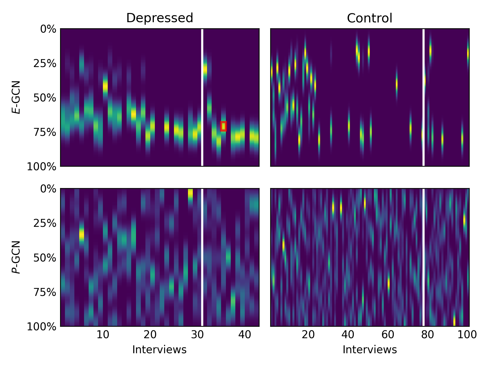

# DAIC-WOZ: On the Validity of Using the Therapist's prompts in Automatic Depression Detection from Clinical Interview

**This repository accompanies [the paper](https://aclanthology.org/2024.clinicalnlp-1.8/) presented at [ClinicalNLP workshop](https://clinical-nlp.github.io/2024/) (NAACL 2024).**

_( :point_right: You might also be interested in [this other work](https://github.com/idiap/Node_weighted_GCN_for_depression_detection), presented at Interspeech 2023)_

## Abstract

> Automatic depression detection from conversational data has gained significant interest in recent years. The DAIC-WOZ dataset, interviews conducted by a human-controlled virtual agent, has been widely used for this task. Recent studies have reported enhanced performance when incorporating interviewer's prompts into the model. In this work, we hypothesize that this improvement might be mainly due to a bias present in these prompts, rather than the proposed architectures and methods. Through ablation experiments and qualitative analysis, we discover that models using interviewer's prompts learn to focus on a specific region of the interviews, where questions about past experiences with mental health issues are asked, and use them as discriminative shortcuts to detect depressed participants. In contrast, models using participant responses gather evidence from across the entire interview. Finally, to highlight the magnitude of this bias, we achieve a 0.90 F1 score by intentionally exploiting it, the highest result reported to date on this dataset using only textual information. Our findings underline the need for caution when incorporating interviewers' prompts into models, as they may inadvertently learn to exploit targeted prompts, rather than learning to characterize the language and behavior that are genuinely indicative of the patient's mental health condition.

---
## 🔬 Paper Replication

### Getting Started

First, make sure your environment and dependencies are all set up:

```bash
$ conda env create -f conda_env.yaml
$ conda activate gcndepression
(gcndepression)$ pip install -r requirements.txt
```

### Results

To compute and show the results you can use the `eval_all_models.py` script that will evaluate all models in `output` folder and also report the result of the ensemble of the best models for Ellie and Participant:
- By default it will print only the macro averaged F1 score for each:
```bash
python eval_all_models.py -i output/
```
Output:
```txt
Best result for 'Ellie': 87.76% (output/Ellie/13_induct-gcn[original-features-1])
Best result for 'Participant': 84.93% (output/Participant/21_induct-gcn[original-features250])
Result ensemble bests 'Participant' and 'Ellie': 90.29%
```
- But you can also print the classification report for each with the `-r` argument:
```bash
python eval_all_models.py -i output/ -r
```
Output:
```text
Best result for 'Ellie': 87.76% (output/Ellie/13_induct-gcn[original-features-1])
              precision    recall  f1-score   support

           0       0.95      0.87      0.91        23
           1       0.79      0.92      0.85        12

    accuracy                           0.89        35
   macro avg       0.87      0.89      0.88        35
weighted avg       0.90      0.89      0.89        35


Best result for 'Participant': 84.93% (output/Participant/21_induct-gcn[original-features250])
              precision    recall  f1-score   support

           0       0.95      0.83      0.88        23
           1       0.73      0.92      0.81        12

    accuracy                           0.86        35
   macro avg       0.84      0.87      0.85        35
weighted avg       0.88      0.86      0.86        35


Result ensemble bests 'Participant' and 'Ellie': 90.29%
              precision    recall  f1-score   support

           0       0.92      0.96      0.94        23
           1       0.91      0.83      0.87        12

    accuracy                           0.91        35
   macro avg       0.91      0.89      0.90        35
weighted avg       0.91      0.91      0.91        35
```

### Figure 1 - Temporal Heatmap

To generate the image you can use the `figure_1_heatmap.py` script which takes as input:
- The path to the interviews file containing only **Ellie** utterances used for **training**.
- The path to the interviews file containing only **Ellie** utterances used for **evaluation**.
- The path to the interviews file containing only **Patient** utterances used for **training**.
- The path to the interviews file containing only **Patient** utterances used for **evaluation**.
- The path to the file with the learned (depression-related) **words** with the model trained only with **Ellie**.
- The path to the file with the learned (depression-related) **words** with the model trained only with **Patient**.
- The path to save the generated plot as a PNG file.

In our case, that is:
```bash
python figure_1_heatmap.py --interviews-train-ellie "data/AVEC_16_data/train_Ellie.txt" \
                           --interviews-dev-ellie "data/AVEC_16_data/dev_Ellie.txt" \
                           --interviews-train-patient "data/AVEC_16_data/train_Participant.txt" \
                           --interviews-dev-patient "data/AVEC_16_data/dev_Participant.txt" \
                           --learned-words-ellie "output/Ellie/13_induct-gcn[original-features-1]/words.csv" \
                           --learned-words-patient "output/Participant/21_induct-gcn[original-features250]/words.csv" \
                           --output-plot "plots/temporal_heatmap.png"
```
Which should generate and save the following image in `plots/temporal_heatmap.png`:


### Figure 2 - Color-coding the Original Interviews

To convert original interviews to HTML files in which learned words are highlighted you can use the `figure_2_color_interviews.py` script which takes as input the following:
- Path to the **original DAIC-WOZ** dataset containing the original interview folders (`<ID>_P/` folders with the `<ID>_TRANSCRIPT.csv` file in it).
- File containing the **IDS** of the interviews we want to convert to HTML visualization files.
- The path to the file with the learned (depression-related) **words** with the model trained only with **Ellie**.
- The path to the file with the learned (depression-related) **words** with the model trained only with **Patient**.
- The **speaker** to highlight ("ellie", "patient", or "both").
- Path to the **output folder** to save all the HTML files for the interviews.

For instance, let's generate the visualization for all evaluation set (`dev_IDS.txt`) in which Ellie is highlighted (as reported in the paper):
```bash
python figure_2_color_interviews.py --daic-woz "/PATH/TO/ORIGINAL/DAIC-WOZ/data/" \
                                    --target-ids "data/AVEC_16_data/dev_IDS.txt" \
                                    --learned-words-ellie "output/Ellie/13_induct-gcn[original-features-1]/words.csv" \
                                    --learned-words-patient "output/Participant/21_induct-gcn[original-features250]/words.csv" \
                                    --speaker ellie \
                                    --output-folder "plots/html"
```
Which should generate one HTML file for each interview in the `--target-ids` file and save them in the [`plots/html/`](plots/html/) folder.
As an example, the files for the interviews 381 (depressed) and 382 (control) are already provided in the folder.


### Models

#### Weights/checkpoints

The checkpoints of the trained models reported in the paper can be found inside the `model` which contains the pickle of the model as well as the vectorizer needed to load the models:
- Ellie: [`model/Ellie`](model/Ellie)
- Participant: [`model/Participant`](model/Participant)

You can use the `load_induct_gcn_model(path_model, path_vectorizer)` function inside the `main.py` script to load the models by providing the path to the two pickle files inside each subfolder above.

This repo also contains the original optuna sqlite database files (`db.sqlite3`) in the `output/Ellie` and `output/Participant` subfolders. This files contain the results reported in the paper after optimization process, to read then simply call the dashboard with database file as follows:
- Ellie
```bash
cd output/Ellie/13_induct-gcn[original-features-1]
$ optuna-dashboard sqlite:///db.sqlite3
```
- Participant
```bash
cd output/Participant/21_induct-gcn[original-features250]
$ optuna-dashboard sqlite:///db.sqlite3
```


#### Re-training from scratch

> ⚠️ Note that the training code (`main.py`) in this repo is a forked and modified version of the original one available [here](https://github.com/idiap/Node_weighted_GCN_for_depression_detection).


In our paper, to train the GCN models we follow the [the original paper](https://arxiv.org/pdf/2307.00920) to train the different variations of the base model, by changing the features selection method (`top-250`, `all`, `auto`) are selected and wheather or not pagerank was used (6 versions in total). In addition, we repeated the same process using either only with Ellie's or Patient's utterances to train the models (giving us a total of 6x2 = 12 model versions).

Similar to the [original paper code](https://github.com/idiap/Node_weighted_GCN_for_depression_detection), the `main.py` script contains the implementation of the InducT-GCN and the training script for all these versions. Run the script first with no arguments to get the list of 12 possible configuration to run:

```bash
$ python main.py

There's a total of 12 task options. List by task id:
  1. Dataset=data/AVEC_16_data/train_Ellie.txt; Features=auto; Pagerank=True;
  2. Dataset=data/AVEC_16_data/train_Ellie.txt; Features=auto; Pagerank=False;
  3. Dataset=data/AVEC_16_data/train_Ellie.txt; Features=top-250; Pagerank=True;
  4. Dataset=data/AVEC_16_data/train_Ellie.txt; Features=top-250; Pagerank=False;
  5. Dataset=data/AVEC_16_data/train_Ellie.txt; Features=all; Pagerank=True;
  6. Dataset=data/AVEC_16_data/train_Ellie.txt; Features=all; Pagerank=False;
  7. Dataset=data/AVEC_16_data/train_Participant.txt; Features=auto; Pagerank=True;
  8. Dataset=data/AVEC_16_data/train_Participant.txt; Features=auto; Pagerank=False;
  9. Dataset=data/AVEC_16_data/train_Participant.txt; Features=top-250; Pagerank=True;
  10. Dataset=data/AVEC_16_data/train_Participant.txt; Features=top-250; Pagerank=False;
  11. Dataset=data/AVEC_16_data/train_Participant.txt; Features=all; Pagerank=True;
  12. Dataset=data/AVEC_16_data/train_Participant.txt; Features=all; Pagerank=False;
```

To train the model by selecting one particular option, you can run the script and pass the option number in the `-i` argument. For instance, suppose we want to run option 1 above, then we call main script simply as follows:

```bash
$ python main.py -i 1
```

To report the results in the paper we followed the following steps:
1. Run all 12 options so you have all versions of the models trained.
2. Use the `eval_all_models.py` script as described in ["Results" section above](#results). This script will evaluate and report the performance of all versions as well as the ensemble of the best Ellie and Patient's performing model (`P-GCN^E-GCN`). Finally, in the paper, we selected the best performing models for Ellie and Patient as `E-GCN` and `P-GCN`, respectively.

> 💡 **Tip:** To speed up the training of all 12 versions you can run multiple instances in parallel, each with different `-i` value. The `main.py` script is coded in such a way that can run in parallel with different `-i` without conflicts and also to run naturally as job arrays in [SGE](http://star.mit.edu/cluster/docs/0.93.3/guides/sge.html) and [Slurm](https://slurm.schedmd.com/documentation.html) using the `-t 1:12` or `--array=1-12` arguments, respectively.
> In this repo we provide the example job scripts to run them (open them and modify them to adjusted to your cluster, credentials, etc.):
> - Slurm:
> ```bash
> sbatch run.sbatch
> ```
> - SGE:
> ```bash
> qsub -P YOUR_PROJECT -t 1:12 sge.job
> ```
---
## :page_facing_up: Citation

If you found the paper and/or this repository useful, please consider citing our work: :blush::+1:

```bibtex
@inproceedings{burdisso-etal-2024-daic,
    title = "{DAIC}-{WOZ}: On the Validity of Using the Therapist`s prompts in Automatic Depression Detection from Clinical Interviews",
    author = "Burdisso, Sergio  and
      Reyes-Ram{\'i}rez, Ernesto  and
      Villatoro-tello, Esa{\'u}  and
      S{\'a}nchez-Vega, Fernando  and
      Lopez Monroy, Adrian  and
      Motlicek, Petr",
    booktitle = "Proceedings of the 6th Clinical Natural Language Processing Workshop",
    month = jun,
    year = "2024",
    address = "Mexico City, Mexico",
    publisher = "Association for Computational Linguistics",
    url = "https://aclanthology.org/2024.clinicalnlp-1.8/",
    doi = "10.18653/v1/2024.clinicalnlp-1.8",
    pages = "82--90"
}

@inproceedings{burdisso23_interspeech,
  title     = {Node-weighted Graph Convolutional Network for Depression Detection in Transcribed Clinical Interviews},
  author    = {Sergio Burdisso and Esaú Villatoro-Tello and Srikanth Madikeri and Petr Motlicek},
  year      = {2023},
  booktitle = {Interspeech 2023},
  pages     = {3617--3621},
  doi       = {10.21437/Interspeech.2023-1923},
  issn      = {2958-1796},
}
```

## :ticket: License

Copyright (c) 2025 [Idiap Research Institute](https://www.idiap.ch/).

Apache-2.0 License.
